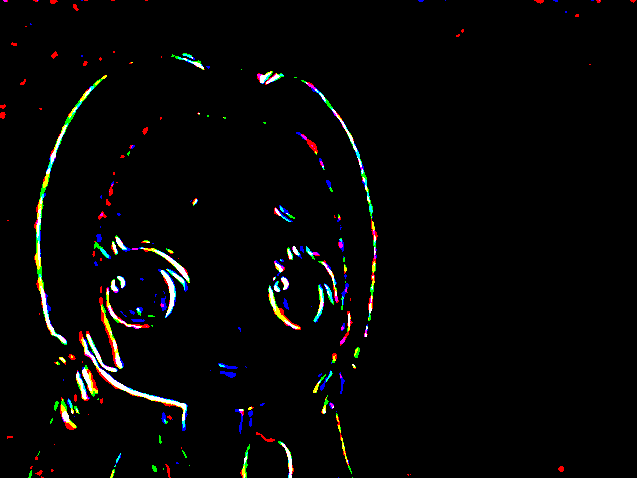
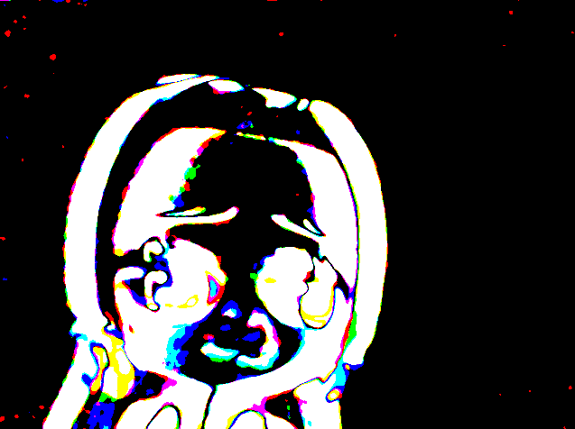

# Background subtraction webcam
An algorithm that uses your webcam to apply background subtraction

Low movement             |  Low movement with subtraction
:-------------------------:|:-------------------------:
  |  

Medium movement             |  Medium movement with subtraction
:-------------------------:|:-------------------------:
  |  

## Setup
- python3
- numpy 
- cv2

```
pip3 install numpy /
pip3 install opencv-python
```

## Getting Started
````
python3 bgs.py
````

## License

[MIT license](LICENSE)
